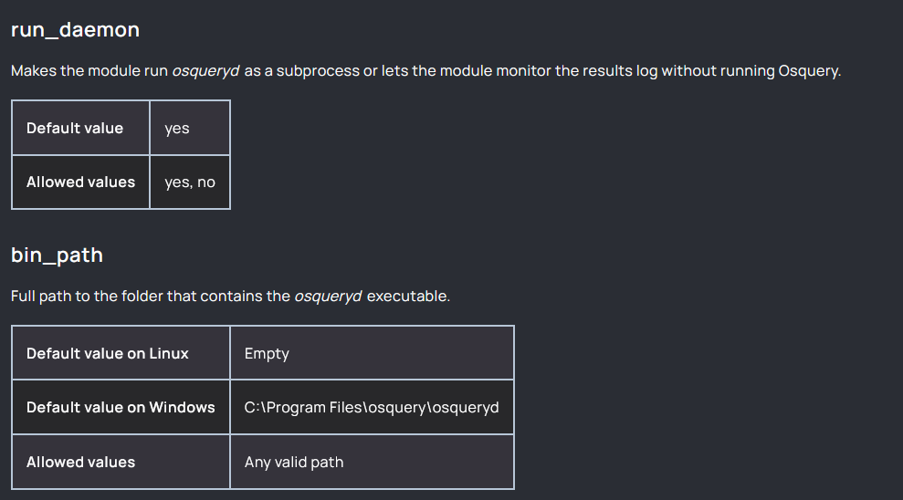

Server Install
https://youtu.be/Ixd5D73zFVY

Server Config
https://youtu.be/zT5RpPR7uhg
#
windows debug
https://documentation.wazuh.com/current/user-manual/reference/ossec-conf/wodle-osquery.html#run-daemon

1. keep default value to yes 
2. remove default value on windows
what is happening is the instance is running twice

#
