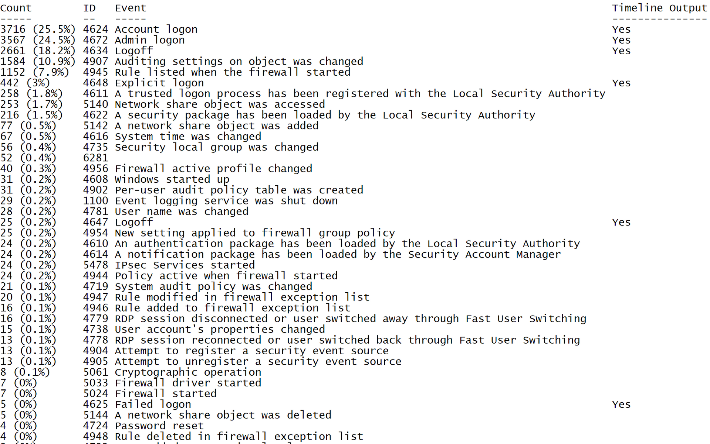

# (log) WELA (Windows Event Log Analyzer)
Windows Event Log Analyzer aims to be the Swiss Army knife for Windows event logs. Currently, WELA's greatest functionality is creating an easy-to-analyze logon timeline in to order to aid in fast forensics and incident response. WELA's logon timeline generator will consolodate only the useful information in multiple logon log entries (4624, 4634, 4647, 4672, 4776) into single events, perform data reduction by ignoring around 90% of the noise, and will convert any hard to read data (such as hex status codes) into human readable format.

#

Download
https://github.com/Yamato-Security/WELA