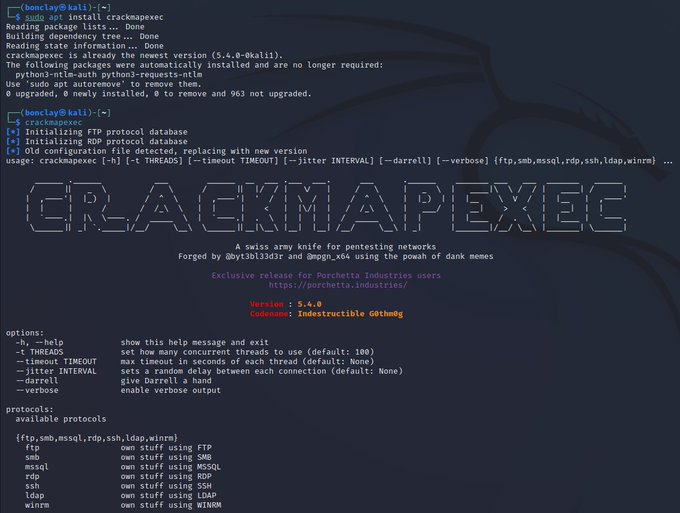

# CrackMapExec
CrackMapExec (a.k.a CME) is a post-exploitation tool that helps automate assessing the security of large Active Directory networks. Built with stealth in mind, CME follows the concept of "Living off the Land": abusing built-in Active Directory features/protocols to achieve it's functionality and allowing it to evade most endpoint protection/IDS/IPS solutions.

# 
site
https://wiki.porchetta.industries/