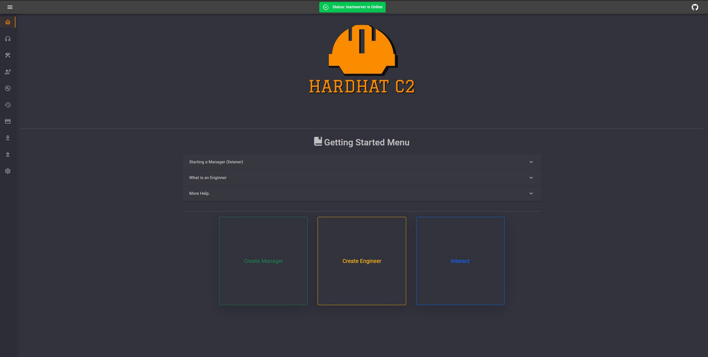

# C# Hardhat C2

A cross-platform, collaborative, Command & Control framework written in C#, designed for red teaming and ease of use.
HardHat is a multiplayer c# .NET-based command and control framework. Designed to aid in red team engagements and penetration testing. HardHat aims to improve the quality of life factors during engagements by providing an easy-to-use but still robust C2 framework.
It contains three primary components, an ASP.NET teamserver, a blazor .NET client, and c# based implants.
#
download 
https://github.com/DragoQCC/HardHatC2