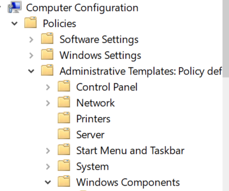
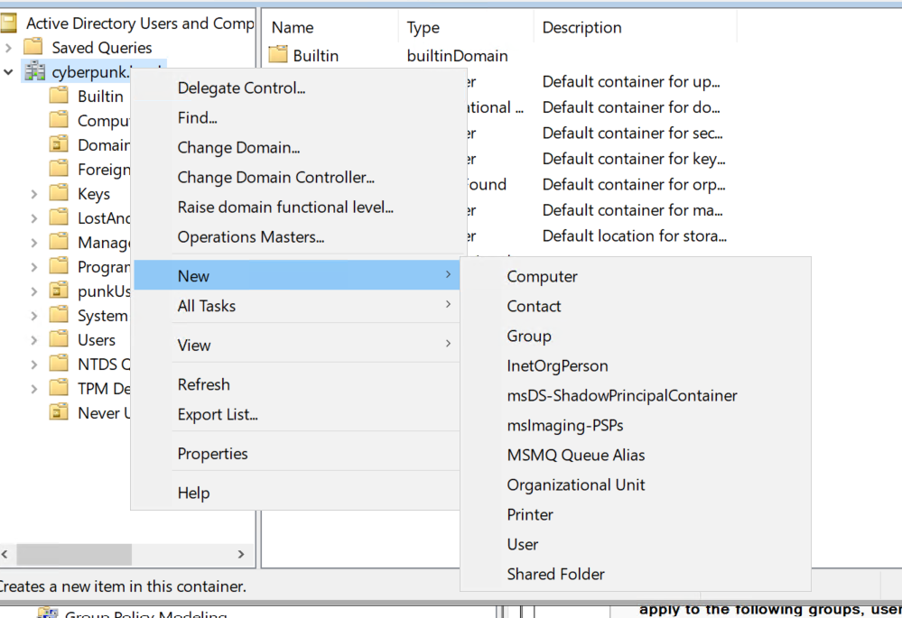
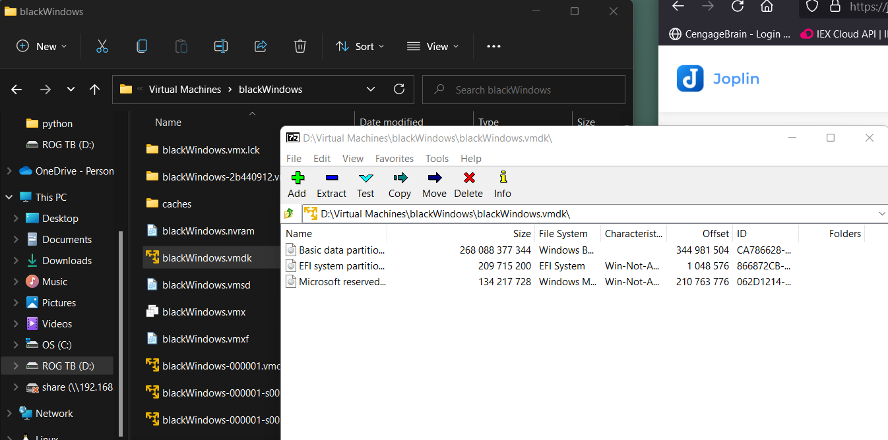

# Havoc C2 Server

repository to install
https://github.com/HavocFramework/Havoc

how to install
https://www.youtube.com/watch?v=ErPKP4Ms28s

#
### notes

- make sure to install all the go lang repositories
- run as root or will block certain actions
- payload is built in 64 bit only

# Helpful commands
after connected to a pc
- checkin
- screenshot 

# how to

config file that works and added a user baric

1.  start teamServer
    a. navigate to where you saved the program
    b. Desktop/Havoc/Teamserver
    c. run: sudo ./teamserver server --profile profiles/havoc.yaotl
    
    
2.  start client
    a. in a new termial navigate to where the client is
    b. Desktop/Havoc/Client
    c. run: sudo ./Havoc
    d. make sure you have the login data correct and hit connect
    
    
3.  client running
    
    
4.  create a custom listener
    
    
5.  create a payload
    
    
6.  put payload on a 64bit windows pc and it should call back
    
7.  right click on exploited windows 10 pc to see options to do
    
    
8.  under explorer option is view processes
    
    
9.  if you hit interact on right click brings up a windows PowerShell to run commands
    