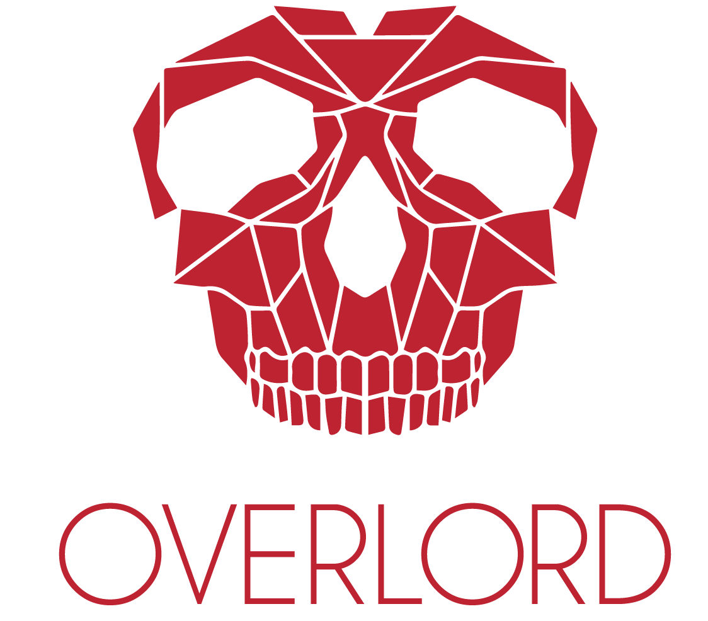

# overlord - red team automation
Overlord provides a python-based console CLI which is used to build Red Teaming infrastructure in an automated way. The user has to provide inputs by using the tool’s modules (e.g. C2, Email Server, HTTP web delivery server, Phishing server etc.) and the full infra / modules and scripts will be generated automatically on a cloud provider of choice. Currently supports AWS and Digital Ocean. The tool is still under development and it was inspired and uses the Red-Baron Terraform implementation found on Github.
#
 download
 https://github.com/qsecure-labs/overlord
 
