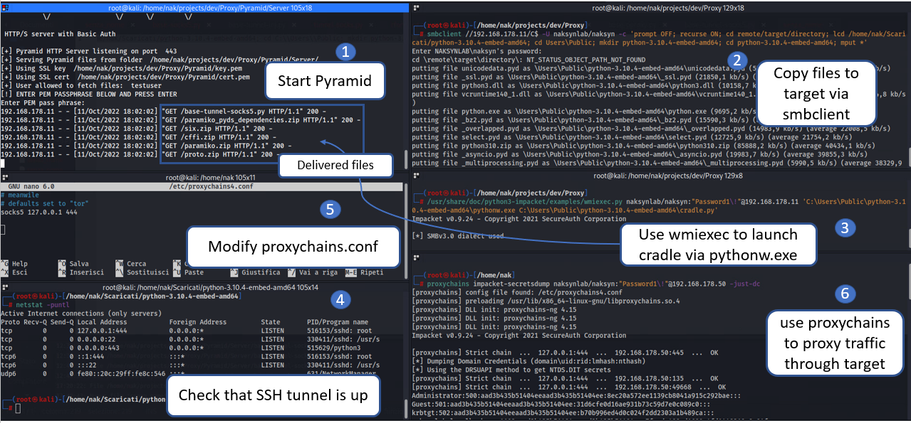

# Pyramid python EDR endpoint
Pyramid is a set of Python scripts and module dependencies that can be used to evade EDRs. The main purpose of the tool is to perform offensive tasks by leveraging some Python evasion properties and looking as a legit Python application usage

#
download 
https://github.com/naksyn/Pyramid#usage