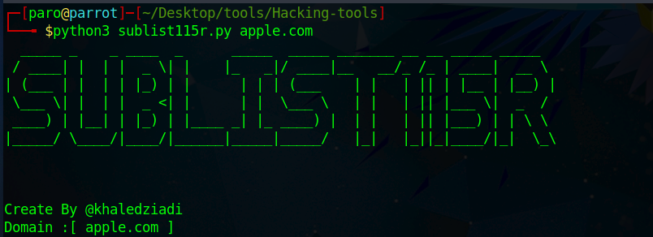

# Sublist115R
About Sublist115r Sublist115r is a python tool designed to enumerate subdomains of websites using OSINT. It helps penetration testers and bug hunters collect and gather subdomains for the domain they are targeting. Sublist115r enumerates subdomains using many search engines such as Google, Yahoo, Bing, Baidu and Ask. Sublist115r also enumerates subdomains using Netcraft, Virustotal, ThreatCrowd, DNSdumpster and ReverseDNS. 

# 
Download
https://github.com/elpirata111/Hacking-tools