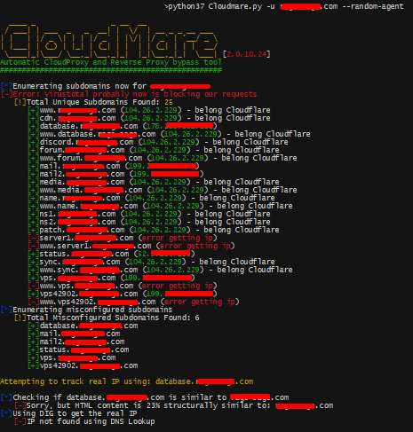

# cloudmare

Cloudmare is a simple tool to find the origin servers of websites protected by Cloudflare, Sucuri, or Incapsula with a misconfiguration DNS.
#
download
https://github.com/mrh0wl/Cloudmare