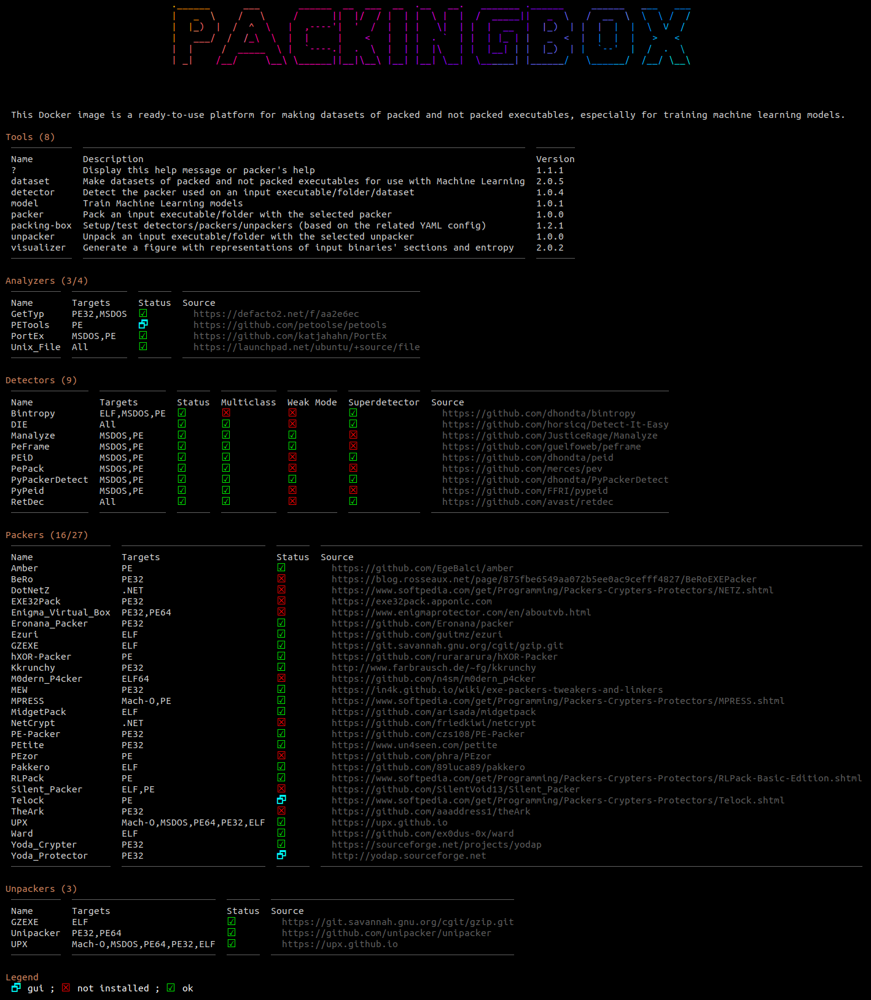

# (RE) docker-packing-box
This Docker container is a CLI environment featuring a toolkit that gathers executable analyzers, packing detectors, packers and unpackers but also many tools for generating and manipulating datasets of packed and not-packed executables of different formats (including PE, ELF and Mach-O) for the sake of evaluating static detection techniques and tools, visualizing executables' layout and automating machine learning pipelines with the support of many algorithms.

#
 
 Download
 https://github.com/packing-box/docker-packing-box