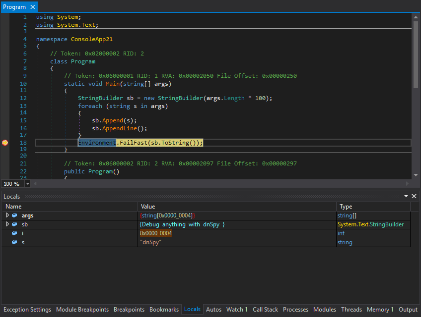

# (debugger) dnSpyEX
dnSpyEx is a unofficial continuation of the dnSpy project which is a debugger and .NET assembly editor. You can use it to edit and debug assemblies even if you don't have any source code available. Main features:
- Debug .NET and Unity assemblies
- Edit .NET and Unity assemblies

#  
download 
https://github.com/dnSpyEx/dnSpy