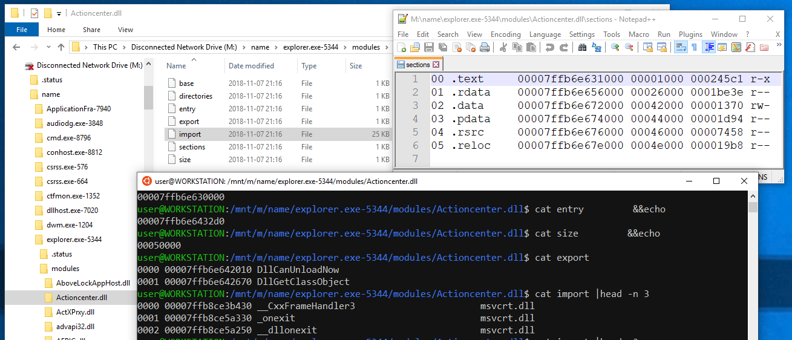

# MemProcFS ram forensics
MemProcFS is an easy and convenient way of viewing physical memory as files in a virtual file system.

Easy trivial point and click memory analysis without the need for complicated commandline arguments! Access memory content and artifacts via files in a mounted virtual file system or via a feature rich application library to include in your own projects!

#
download
https://github.com/ufrisk/MemProcFS