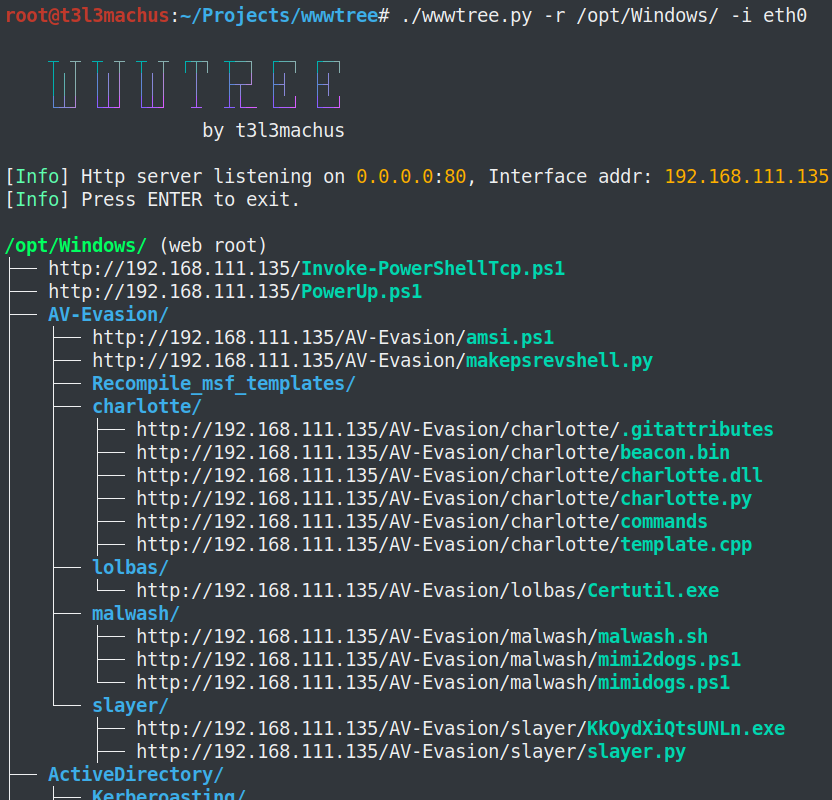

# wwwtree 
A utility for quickly and easily locating, web hosting and transferring resources (e.g., exploits/enumeration scripts) from your filesystem to a victim machine during privilege escalation.

# 
download
https://github.com/t3l3machus/wwwtree