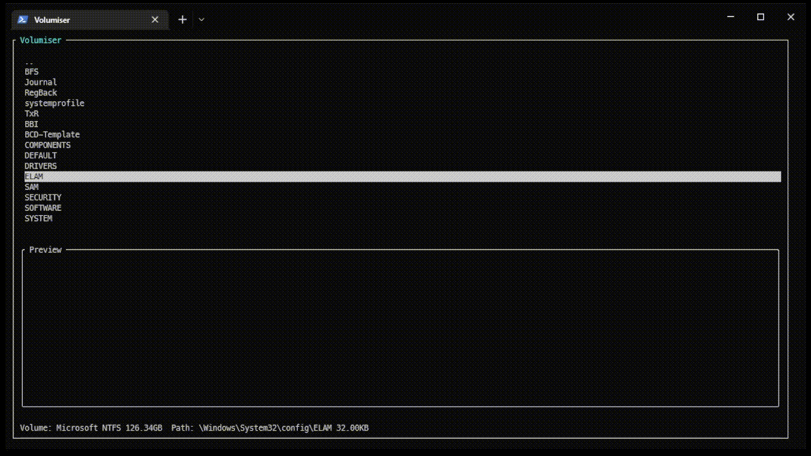

# Volumiser
Volumiser is a command line tool and interactive console GUI for listing, browsing and extracting files from common virtual machine hard disk image formats.

The tool was written to combat a regular problem where massive 100G+ disk images are often hard to work with or exfiltrate when performing red team operations. Whilst the tool was created for offensive operations, the tool also has benefits outside of it's original intended purpose.

# 
github
https://github.com/CCob/Volumiser