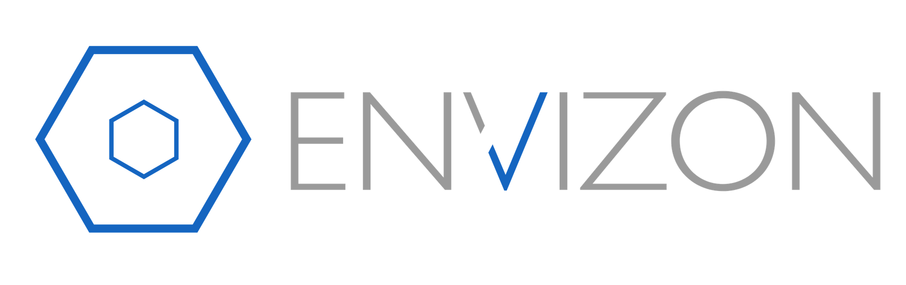

# Envizon network visual and pentesting 

This tool is designed, developed and supported by evait security. In order to give something back to the security community, we publish our internally used and developed, state of the art network visualization and vulnerability reporting tool, 'envizon'. We hope your feedback will help to improve and hone it even further.
#
Download 
https://github.com/evait-security/envizon