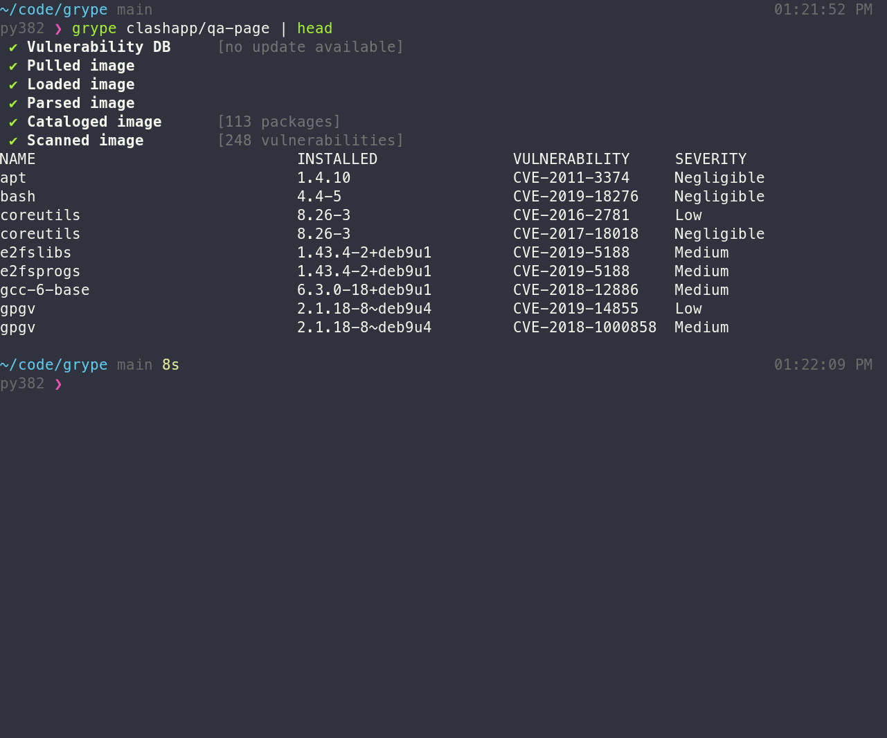

# Grype container img vuln scanner 

A vulnerability scanner for container images and filesystems. Easily install the binary to try it out. Works with Syft, the powerful SBOM (software bill of materials) tool for container images and filesystems.

#
Download
https://github.com/anchore/grype