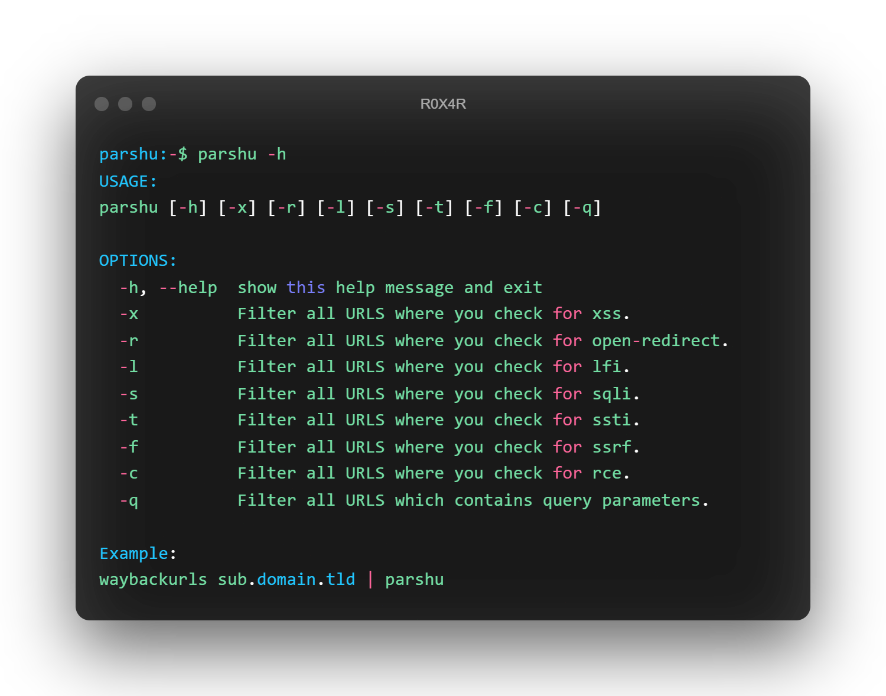

# Parchu web vuln checker

Parshu uses regex to filter out the custom results. Remembering every regex or writing regexes for a task which you do daily is not easy, so parshu will help you to automate the task.

#
downloa
https://github.com/R0X4R/Parshu