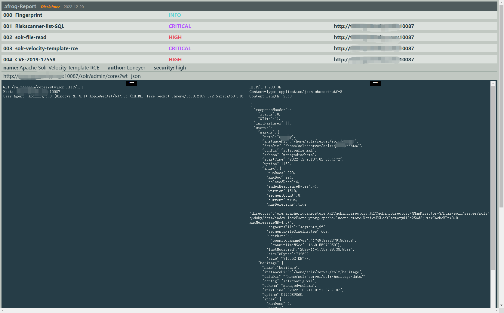

# aFrog vuln scanner

afrog is an excellent performance, fast and stable, PoC customizable vulnerability scanning (hole digging) tool. PoC involves CVE, CNVD, default password, information leakage, fingerprint identification, unauthorized access, arbitrary file reading, command execution, etc. It helps network security practitioners quickly verify and fix vulnerabilities in a timely manner.
# 
download
https://github.com/zan8in/afrog