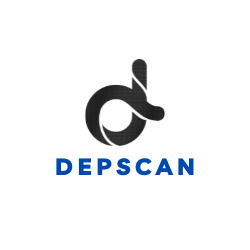

# dep-scan security audit

dep-scan is a fully open-source security audit tool for project dependencies based on known vulnerabilities, advisories and license limitations. Both local repositories and container images are supported as input. The tool is ideal for CI environments with built-in build breaker logic.

Scan most application code - local repos, Linux container images, Kubernetes manifests, and OS - to identify known CVEs with prioritization
#
download
https://github.com/AppThreat/dep-scan