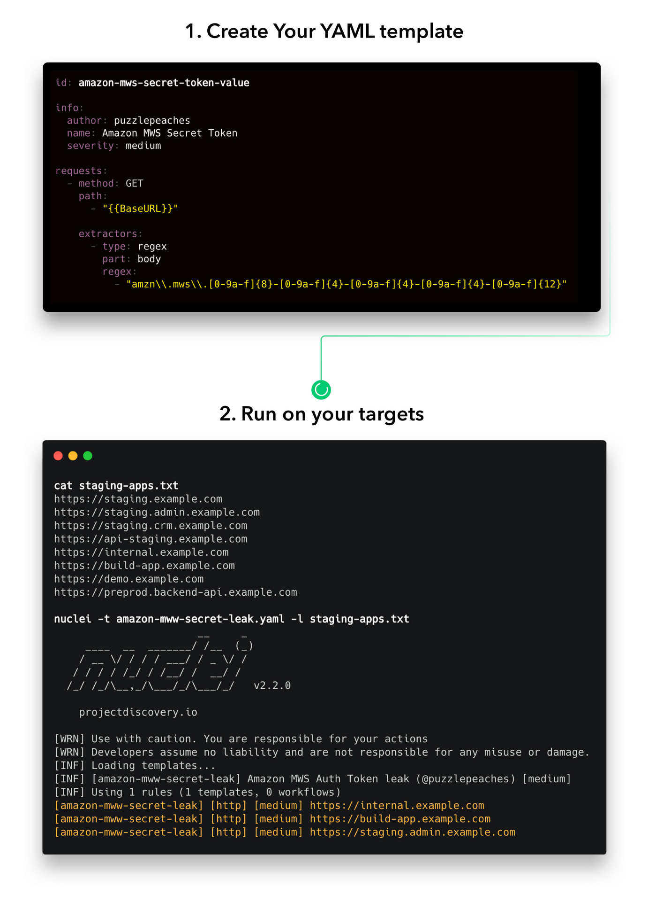

# nuclei 

Nuclei is used to send requests across targets based on a template, leading to zero false positives and providing fast scanning on a large number of hosts. Nuclei offers scanning for a variety of protocols, including TCP, DNS, HTTP, SSL, File, Whois, Websocket, Headless etc. With powerful and flexible templating, Nuclei can be used to model all kinds of security checks.

We have a dedicated repository that houses various type of vulnerability templates contributed by more than 300 security researchers and engineers.
#
releases
https://github.com/projectdiscovery/nuclei/releases/tag/v2.8.0
#
github
https://github.com/projectdiscovery/nuclei
#
fuzzing templates
https://github.com/projectdiscovery/fuzzing-templates
#
nuclei community powered vuln scanner
https://nuclei.projectdiscovery.io/nuclei/get-started/
# 
helpful links
1. https://pentestwiki.org/academy/how-to-use-nuclei-for-vulnerability-scanning/