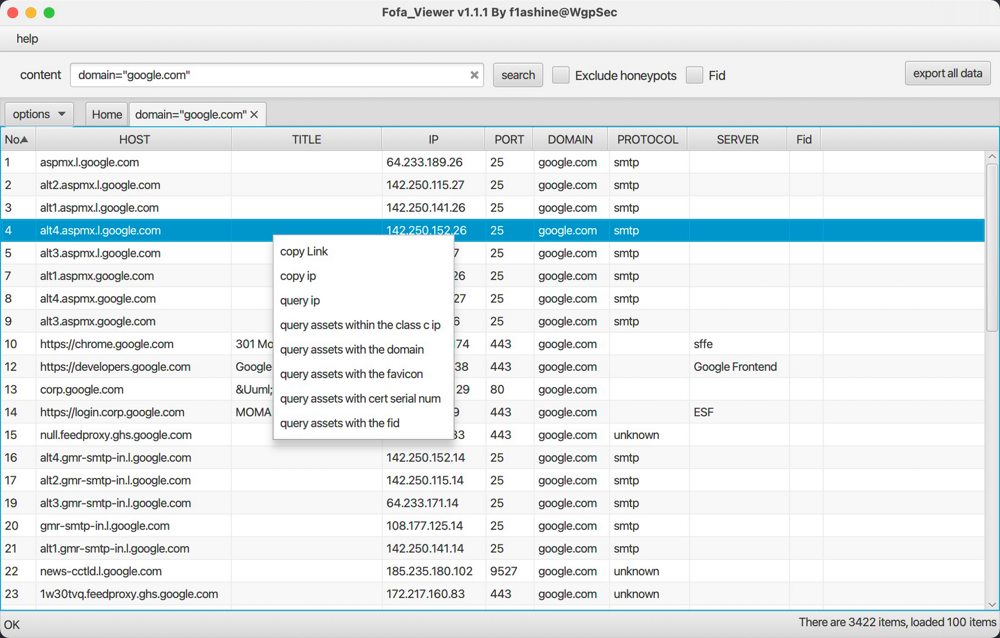

# FOFA Viewer web scanner
Fofa Viewer is a user-friendly FOFA client written in JavaFX, attributed to the WgpSec Community and primarily maintained by f1ashine. By leveraging the powerful internet search engine FoFa, it encapsulates many commonly used APIs into a concise UI, making it easier for cybersecurity professionals to hunt for vulnerabilities on target websites. With its out-of-the-box functionality, Fofa Viewer streamlines the search process, helping penetration testers quickly obtain the information they need.

#
download
https://github.com/wgpsec/fofa_viewer/blob/master/README.en.md